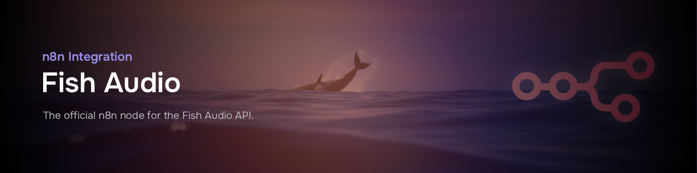

# n8n-nodes-fishaudio

This is an n8n community node for [Fish Audio](https://fish.audio) - a platform for text-to-speech, speech-to-text, and voice cloning.

[n8n](https://n8n.io/) is a [fair-code licensed](https://docs.n8n.io/sustainable-use-license/) workflow automation platform.

## Installation

Follow the [installation guide](https://docs.n8n.io/integrations/community-nodes/installation/) in the n8n community nodes documentation.

## Operations

### Speech

| Operation      | Description                                          |
|----------------|------------------------------------------------------|
| **Generate**   | Convert text to speech using Fish Audio's TTS models |
| **Transcribe** | Convert speech to text using Fish Audio's ASR        |

### Voice Model

| Operation  | Description                                 |
|------------|---------------------------------------------|
| **List**   | List available voice models                 |
| **Get**    | Get details of a specific voice model       |
| **Create** | Create a new voice model from audio samples |
| **Delete** | Delete a voice model                        |

### Account

| Operation       | Description                   |
|-----------------|-------------------------------|
| **Get Credits** | Check your API credit balance |

## Credentials

To use this node, you need a Fish Audio API key:

1. Create an account at [fish.audio](https://fish.audio)
2. Navigate to [API Keys](https://fish.audio/app/api-keys) in your dashboard
3. Generate a new API key
4. Add the API key to your n8n credentials

## Resources

- [Fish Audio](https://fish.audio)
- [Fish Audio API Documentation](https://docs.fish.audio)
- [n8n Community Nodes Documentation](https://docs.n8n.io/integrations/community-nodes/)